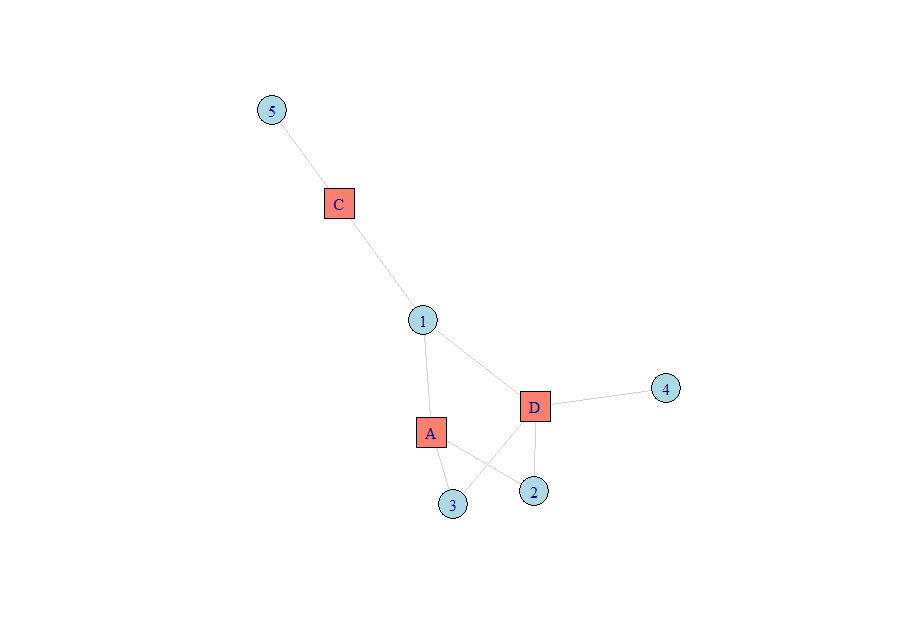

<!-- badges: start -->
[](https://www.repostatus.org/#active)
[](https://cran.r-project.org/package=CareDensity)
[](https://cran.r-project.org/package=CareDensity)
[](https://github.com/RobinDenz1/CareDensity/actions/workflows/R-CMD-check.yaml)
[](https://app.codecov.io/gh/RobinDenz1/CareDensity?branch=main)
<!-- badges: end -->

# CareDensity

Author: Robin Denz

## Description

`CareDensity` is a small R-Package which can be used to calculate the care density index and the fragmented care density.

## Installation

A developmental version of this package may be installed from github using the `remotes` R-Package:

```R
library(remotes)

remotes::install_github("RobinDenz1/CareDensity")
```

## Bug Reports and Feature Requests

If you encounter any bugs or have any specific feature requests, please file an [Issue](https://github.com/RobinDenz1/CareDensity/issues).

## Examples

Suppose you have the following patient-provider data:

```R
data <- data.frame(PatID=c("1", "1", "1", "2", "2", "3", "3", "4", "5"),
                   ArztID=c("A", "C", "D", "A", "D", "A", "D", "D", "C"))
```

This is essentially a description of the following bipartite network:



The simple care density can then be calculated like this:

```R
care_density(data)
```

## Citation

Use `citation("CareDensity")` to get the relevant citation information.

## License

© 2024 Robin Denz

The contents of this repository are distributed under the GNU General Public License. You can find the full text of this License in this github repository. Alternatively, see <http://www.gnu.org/licenses/>.
